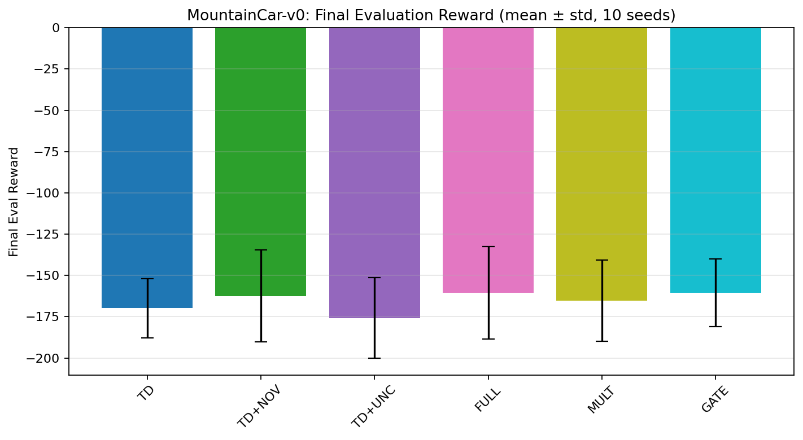

# Dopamine-Inspired Reinforcement Learning for Improved Exploration

Final Year Project investigating whether biologically inspired reward-prediction signals can improve exploration in deep reinforcement learning.

**Author:** Sharifah Fadilah Syed Azlan  
**Institution:** University of Nottingham Malaysia  
**Supervisor:** Tomás Maul

## Overview

Standard reinforcement learning agents typically learn from a temporal-difference (TD) reward-prediction error. This project explores a broader, dopamine-inspired signal that also incorporates **novelty** and **uncertainty**.

The proposed agent, `BootstrapBioAgent`, combines:

- **TD error** for reward-based learning;
- **Random Network Distillation (RND)** for novelty estimation;
- **ensemble disagreement** for uncertainty estimation;
- a **biological reward-prediction error (bio-RPE)** that integrates these signals; and
- adaptive modulation of the agent's **learning rate** and **epsilon-greedy exploration**.

The framework is evaluated on three Gymnasium control environments under six experimental conditions to compare the contribution of novelty, uncertainty, and different bio-RPE integration strategies.

## Research Question

Can a dopamine-inspired reward-prediction error that combines TD error, novelty, and uncertainty improve exploration and learning compared with a conventional bootstrapped DQN baseline?

## Method

The implementation uses an ensemble of five Q-networks with bootstrapped experience masking. Novelty is estimated using RND, while uncertainty is estimated from variance across the Q-network ensemble.

For the additive formulation, the biological reward-prediction error is:

```text
bio-RPE = TD error + alpha * novelty + beta * uncertainty
```

The novelty and uncertainty weights are dynamically modulated based on the magnitude of the TD error. The magnitude of the resulting bio-RPE is then used to adapt both learning-rate scaling and epsilon-greedy exploration.

Three integration mechanisms are evaluated: **additive**, **multiplicative**, and **gated**.

## Experimental Conditions

| Condition | Novelty | Uncertainty | Integration | Purpose |
|---|---:|---:|---|---|
| `TD` | No | No | Baseline | Bootstrapped DQN baseline |
| `TD+NOV` | Yes | No | Additive | Isolate the effect of novelty |
| `TD+UNC` | No | Yes | Additive | Isolate the effect of uncertainty |
| `FULL` | Yes | Yes | Additive | Combine all three signals |
| `MULT` | Yes | Yes | Multiplicative | Test multiplicative integration |
| `GATE` | Yes | Yes | Gated | Dynamically gate novelty vs. uncertainty |

## Environments

Experiments are run on:

- `CartPole-v1` — dense-reward control task;
- `MountainCar-v0` — exploration-sensitive sparse-reward task; and
- `Acrobot-v1` — underactuated control task with delayed progress.

The current repository configuration uses:

| Environment | Episodes | Evaluation interval | Evaluation episodes |
|---|---:|---:|---:|
| CartPole-v1 | 500 | 25 | 5 |
| MountainCar-v0 | 700 | 25 | 5 |
| Acrobot-v1 | 500 | 25 | 5 |

The default configuration currently runs **10 random seeds** across all six conditions.

## Repository Structure

```text
FYP-Dopamine-Inspired-RL/
├── src/
│   ├── FYP.py              # Agent, training loop and experiment entry point
│   ├── analysis_plot.py    # Plotting, analysis and CSV reporting
│   └── config.py           # Experiment and output configuration
├── results/
│   └── results_29_0926/    # Saved experiment outputs included in this repository
├── 20509986_Final Report (2).pdf
└── README.md
```

## Main Components

### `src/FYP.py`

Contains the reinforcement-learning implementation, including:

- `QNetwork` — two-hidden-layer MLP used by each ensemble head;
- `RNDModel` — fixed target and trainable predictor networks for novelty estimation;
- `AgentConfig` — agent hyperparameters;
- `BootstrapBioAgent` — bootstrapped DQN agent with novelty, uncertainty and bio-RPE integration;
- uncertainty estimation from ensemble Q-value variance;
- additive, multiplicative and gated bio-RPE formulations;
- adaptive learning-rate and epsilon modulation;
- training and greedy evaluation loops; and
- multi-seed, multi-condition experiment execution.

### `src/analysis_plot.py`

Generates plots and CSV summaries for training performance and internal agent signals, including:

- training and evaluation reward curves;
- TD error, novelty, uncertainty, bio-RPE and epsilon trajectories;
- state-visitation heatmaps;
- final evaluation comparisons;
- novelty-versus-familiarity analysis;
- adaptive alpha/beta coefficients;
- learning-rate scaling;
- bio-RPE decomposition;
- bio-RPE/reward correlation; and
- per-seed novelty trajectories.

### `src/config.py`

Centralises experiment settings such as:

- environments;
- seeds;
- episode budgets;
- experimental conditions;
- CPU/GPU device;
- output location; and
- plotting/reporting switches.

Change this file before running an experiment rather than editing the training code directly.

## Installation

### 1. Clone the repository

```bash
git clone https://github.com/FadilahSyed/FYP-Dopamine-Inspired-RL.git
cd FYP-Dopamine-Inspired-RL
```

### 2. Create a virtual environment (recommended)

```bash
python -m venv .venv
```

Activate it on Windows:

```powershell
.\.venv\Scripts\Activate.ps1
```

Or on macOS/Linux:

```bash
source .venv/bin/activate
```

### 3. Install dependencies

```bash
python -m pip install gymnasium torch numpy matplotlib scipy
```

The project was developed with Python 3 and uses PyTorch, Gymnasium, NumPy, Matplotlib and SciPy.

## Running the Experiments

From the repository root:

```bash
python src/FYP.py
```

The experiment settings can be changed in `src/config.py`.

For example, to run only MountainCar:

```python
RUN_ENVS = ["MountainCar-v0"]
```

To run only the baseline and novelty condition:

```python
CONDITIONS = ["TD", "TD+NOV"]
```

For a quick test, reduce the number of seeds:

```python
SEEDS = tuple(range(2))
```

## Output

By default, new runs save plots and CSV files to:

```text
~/results
```

This can be changed in `src/config.py`:

```python
OUTPUT_DIR = os.path.expanduser("~/results")
```

A set of previously generated outputs is also included under:

```text
results/results_29_0926/
```

with separate directories for `CartPole-v1`, `MountainCar-v0`, and `Acrobot-v1`.

Typical outputs include:

- raw and rolling training-reward curves;
- greedy evaluation-reward curves;
- final/best evaluation summaries;
- per-seed results;
- TD-error, novelty, uncertainty and bio-RPE curves;
- epsilon and learning-rate behaviour;
- state-visitation heatmaps; and
- CSV files containing the underlying values used for analysis.

## Example Result

A representative generated comparison can be found here:



Additional plots and the corresponding CSV data are available in the `results/` directory.

## Key Hyperparameters

| Parameter | Default |
|---|---:|
| Ensemble size | 5 |
| Learning rate | 3e-4 |
| Discount factor | 0.99 |
| Replay-buffer capacity | 20,000 |
| Batch size | 64 |
| Bootstrap mask probability | 0.8 |
| Gradient clipping | 10.0 |
| Maximum novelty weight (`alpha`) | 0.05 |
| Maximum uncertainty weight (`beta`) | 0.05 |
| Minimum epsilon | 0.01 |
| Epsilon smoothing | 0.01 |
| Target update | Hard |

## Reproducibility

The experiment explicitly seeds Python, NumPy, PyTorch, and the Gymnasium environment for each run. Results are aggregated across multiple seeds rather than relying on a single training trajectory.

Because reinforcement-learning experiments remain stochastic, exact numerical results can still vary depending on library versions, hardware and environment configuration.

## Final Report

The repository includes the accompanying dissertation report:

```text
20509986_Final Report (2).pdf
```

The report contains the full motivation, literature review, methodology, experimental analysis, discussion, limitations and conclusions for the project.

## License

This project is provided for academic and portfolio purposes. See the repository's license file for details.
